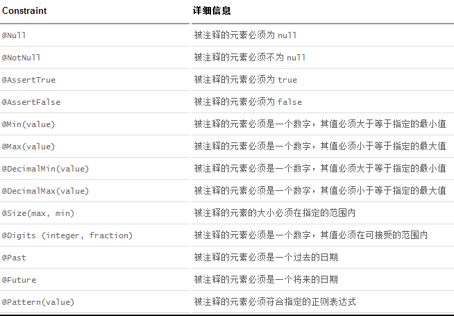

# SpringMVC的使用

### （1）SpringMVC的请求处理

##### 1、SpringMVC对请求参数的处理

​ 在之前的servlet中我们可以通过request.getParameter()来获取请求中的参数，但是在我们编写的SpringMVC的应用程序中，在具体请求的方法中并不包含request参数，那么我们应该如何获取请求中的参数呢？

​ 需要使用以下几个注解：

​ @RequestParam：获取请求的参数

​ @RequestHeader：获取请求头信息

​ @CookieValue：获取cookie中的值

@RequestParam的基本使用

```java
package com.zab.controller;

import org.springframework.stereotype.Controller;
import org.springframework.web.bind.annotation.RequestMapping;
import org.springframework.web.bind.annotation.RequestParam;

@Controller
public class RequestController {

    /**
     * 如何获取SpringMVC中请求中的信息
     *  默认情况下，可以直接在方法的参数中填写跟请求一样的名称，此时会默认接受参数
     *      如果有值，直接赋值，如果没有，那么直接给空值
     *
     * @RequestParam:
     *     获取请求中的参数值, 使用此注解之后，参数的名称不需要跟请求的名称一致，但是必须要写
     *      public String request(@RequestParam("user") String username){
     *
     *      此注解还包含三个参数：
     *      value:表示要获取的参数值
     *      required：表示此参数是否必须，默认是true，如果不写参数那么会报错，如果值为false，那么不写参数不会有任何错误
     *      defaultValue:如果在使用的时候没有传递参数，那么定义默认值即可
     *
     * @param username
     * @return
     */
    @RequestMapping("/request")
    public String request(@RequestParam(value = "user", required = false, defaultValue = "hehe") String username) {
        System.out.println(username);
        return "success";
    }
}

```

@RequestHeader的基本使用：

```java
package com.zab.controller;

import org.springframework.stereotype.Controller;
import org.springframework.web.bind.annotation.RequestHeader;
import org.springframework.web.bind.annotation.RequestMapping;
import org.springframework.web.bind.annotation.RequestParam;
import sun.management.resources.agent;

@Controller
public class RequestController {

    /**
     * 如果需要获取请求头信息该如何处理呢？
     *  可以使用@RequestHeader注解，
     *      public String header(@RequestHeader("User-Agent") String agent){
     *      相当于  request.getHeader("User-Agent")
     *
     *      如果要获取请求头中没有的信息，那么此时会报错，同样，此注解中也包含三个参数,跟@RequestParam一样
     *          value
     *          required
     *          defaultValue
     * @param agent
     * @return
     */
    @RequestMapping("/header")
    public String header(@RequestHeader("User-Agent") String agent) {
        System.out.println(agent);
        return "success";
    }
}

```

@CookieValue的基本使用

```java
package com.zab.controller;

import org.springframework.stereotype.Controller;
import org.springframework.web.bind.annotation.CookieValue;
import org.springframework.web.bind.annotation.RequestHeader;
import org.springframework.web.bind.annotation.RequestMapping;
import org.springframework.web.bind.annotation.RequestParam;
import sun.management.resources.agent;

@Controller
public class RequestController {

    /**
     * 如果需要获取cookie信息该如何处理呢？
     *  可以使用@CookieValue注解，
     *      public String cookie(@CookieValue("JSESSIONID") String id){
     *      相当于
     *      Cookie[] cookies = request.getCookies();
     *      for(Cookie cookie : cookies){
     *          cookie.getValue();
     *      }
     *      如果要获取cookie中没有的信息，那么此时会报错，同样，此注解中也包含三个参数,跟@RequestParam一样
     *          value
     *          required
     *          defaultValue
     * @param id
     * @return
     */
    @RequestMapping("/cookie")
    public String cookie(@CookieValue("JSESSIONID") String id) {
        System.out.println(id);
        return "success";
    }
}
```

​ 如果请求中传递的是某一个对象的各个属性值，此时如何在控制器的方法中获取对象的各个属性值呢？

​ 在SpringMVC的控制中，能直接完成对象的属性赋值操作，不需要人为干预。

User.java

```java
package com.zab.bean;

import java.util.Date;

public class User {
    private Integer id;
    private String name;
    private Integer age;
    private Date date;
    private Address address;

    public Integer getId() {
        return id;
    }

    public void setId(Integer id) {
        this.id = id;
    }

    public String getName() {
        return name;
    }

    public void setName(String name) {
        this.name = name;
    }

    public Integer getAge() {
        return age;
    }

    public void setAge(Integer age) {
        this.age = age;
    }

    public Date getDate() {
        return date;
    }

    public void setDate(Date date) {
        this.date = date;
    }

    public Address getAddress() {
        return address;
    }

    public void setAddress(Address address) {
        this.address = address;
    }

    @Override
    public String toString() {
        return "User{" +
                "id=" + id +
                ", name='" + name + '\'' +
                ", age=" + age +
                ", date=" + date +
                ", address=" + address +
                '}';
    }
}
```

Address.java

```java
package com.zab.bean;

public class Address {
    private String province;
    private String city;
    private String town;

    public String getProvince() {
        return province;
    }

    public void setProvince(String province) {
        this.province = province;
    }

    public String getCity() {
        return city;
    }

    public void setCity(String city) {
        this.city = city;
    }

    public String getTown() {
        return town;
    }

    public void setTown(String town) {
        this.town = town;
    }

    @Override
    public String toString() {
        return "Address{" +
                "province='" + province + '\'' +
                ", city='" + city + '\'' +
                ", town='" + town + '\'' +
                '}';
    }
}
```

UserController.java

```java
package com.zab.controller;

import com.zab.bean.User;
import org.springframework.stereotype.Controller;
import org.springframework.web.bind.annotation.RequestMapping;

@Controller
public class UserController {

    @RequestMapping("/addUser")
    public String addUser(User user) {
        System.out.println(user);
        return "success";
    }
}
```

##### 2、SpringMVC对原生API的支持

```java
package com.zab.controller;

import com.zab.bean.User;
import org.springframework.stereotype.Controller;
import org.springframework.web.bind.annotation.RequestMapping;

import javax.servlet.ServletInputStream;
import javax.servlet.ServletOutputStream;
import javax.servlet.http.HttpServletRequest;
import javax.servlet.http.HttpServletResponse;
import javax.servlet.http.HttpSession;
import java.io.BufferedReader;
import java.io.PrintWriter;

@Controller
public class UserController {

    @RequestMapping("/addUser")
    public String addUser(User user) {
        System.out.println(user);
        return "success";
    }

    /**
     * SpringMVC也可以在参数上使用原生的Servlet API
     *
     *  HttpSession
     *  HttpServletRequest
     *  HttpServletResponse
     *
     *  java.security.Principal 安全协议相关
     *  Locale：国际化相关的区域信息对象
     *  InputStream:
     *      ServletInputStream inputStream = request.getInputStream();
     *  OutputStream:
     *      ServletOutputStream outputStream = response.getOutputStream();
     *  Reader:
     *      BufferedReader reader = request.getReader();
     *  Writer:
     *      PrintWriter writer = response.getWriter();
     * @param session
     * @param request
     * @param response
     * @return
     */
    @RequestMapping("api")
    public String api(HttpSession session, HttpServletRequest request, HttpServletResponse response) {
        request.setAttribute("requestParam", "request");
        session.setAttribute("sessionParam", "session");
        return "success";
    }
}
```

##### 3、使用Model，Map，ModelMap传输数据到页面

​ 在刚开始的helloworld项目中，我们传递了参数回到我们页面，但是后续的操作都只是接受用户的请求，那么在SpringMVC中除了可以使用原生servlet的对象传递数据之外，还有什么其他的方式呢？

​ 可以在方法的参数上传入Model，ModelMap,Map类型，此时都能够将数据传送回页面

OutputController.java

```java
package com.zab.controller;

import org.springframework.stereotype.Controller;
import org.springframework.ui.Model;
import org.springframework.ui.ModelMap;
import org.springframework.web.bind.annotation.RequestMapping;

import java.util.Map;

@Controller
public class OutputController {

    @RequestMapping("output1")
    public String output1(Model model) {
        model.addAttribute("msg", "hello,Springmvc");
        return "output";
    }

    @RequestMapping("output2")
    public String output2(ModelMap model) {
        model.addAttribute("msg", "hello,Springmvc");
        return "output";
    }

    @RequestMapping("output3")
    public String output1(Map map) {
        map.put("msg", "hello,Springmvc");
        return "output";
    }
}
```

当使用此方式进行设置之后，会发现所有的参数值都设置到了request作用域中，那么这三个对象是什么关系呢？


##### 4、使用ModelAndView对象传输数据到页面

```java
package com.zab.controller;

import org.springframework.stereotype.Controller;
import org.springframework.web.bind.annotation.RequestMapping;
import org.springframework.web.servlet.ModelAndView;

@Controller
public class OutputController {

    @RequestMapping("mv")
    public ModelAndView mv() {
        ModelAndView mv = new ModelAndView();
        mv.setViewName("output");
        mv.addObject("msg", "hello.modelAndView");
        return mv;
    }
}
```

​ 发现当使用modelAndView对象的时候，返回值的类型也是此对象，可以将要跳转的页面设置成view的名称，来完成跳转的功能，同时数据也是放到request作用中。

##### 5、使用forward实现页面转发

​ 在发送请求的时候，可以通过forward:来实现转发的功能：

```java
package com.zab.controller;

import org.springframework.stereotype.Controller;
import org.springframework.web.bind.annotation.RequestMapping;

@Controller
public class ForWardController {

    /**
     * 当使用转发的时候可以添加前缀forward:index.jsp,此时是不会经过视图解析器的，所以要添加完整的名称
     *
     * forward:也可以由一个请求跳转到另外一个请求
     *
     * @return
     */
    @RequestMapping("/forward01")
    public String forward() {
        System.out.println("1");
        return "forward:/index.jsp";
    }


    @RequestMapping("/forward02")
    public String forward2() {
        System.out.println("2");
        return "forward:/forward01";
    }
}
```

##### 6、使用redirect来实现重定向

```java
package com.zab.controller;

import org.springframework.stereotype.Controller;
import org.springframework.web.bind.annotation.RequestMapping;

@Controller
public class RedirectController {


    /**
     * redirect :重定向的路径
     *      相当于 response.sendRedirect("index.jsp")
     *      跟视图解析器无关
     * @return
     */
    @RequestMapping("redirect")
    public String redirect() {
        System.out.println("redirect");
        return "redirect:/index.jsp";
    }

    @RequestMapping("/redirect2")
    public String redirect2() {
        System.out.println("redirect2");
        return "redirect:/redirect";
    }
}

```

在javaweb的时候大家应该都接触过重定向和转发的区别，下面再详细说一下：

转发：

​ 由服务器的页面进行跳转，不需要客户端重新发送请求：

​ 特点如下：

​ 1、地址栏的请求不会发生变化，显示的还是第一次请求的地址

​ 2、请求的次数，有且仅有一次请求

​ 3、请求域中的数据不会丢失

​ 4、根目录：localhost:8080/项目地址/,包含了项目的访问地址


重定向：

​ 在浏览器端进行页面的跳转，需要发送两次请求（第一次是人为的，第二次是自动的）

​ 特点如下：

​ 1、地址栏的地址发生变化，显示最新发送请求的地址

​ 2、请求次数：2次

​ 3、请求域中的数据会丢失，因为是不同的请求

​ 4、根目录：localhost:8080/ 不包含项目的名称


​ 对比：

| **区别**         | **转发forward()**  | **重定向sendRedirect()** |
| ---------------- | ------------------ | ------------------------ |
| **根目录**       | 包含项目访问地址   | 没有项目访问地址         |
| **地址栏**       | 不会发生变化       | 会发生变化               |
| **哪里跳转**     | 服务器端进行的跳转 | 浏览器端进行的跳转       |
| **请求域中数据** | 不会丢失           | 会丢失                   |

### （2）自定义视图解析器

​ 我们在之前的操作中已经用了SpringMVC中提供的视图解析器，那么如果我们需要实现自己的视图解析器该如何操作呢？


MyViewController.java

```java
package com.zab.controller;

import org.springframework.stereotype.Controller;
import org.springframework.ui.Model;
import org.springframework.web.bind.annotation.RequestMapping;

@Controller
public class MyViewController {

    @RequestMapping("/myview")
    public String myView(Model model) {
        model.addAttribute("zs", "张三");
        return "zs:/index";
    }
}
```

MyViewResolver.java

```java
package com.zab.view;

import org.springframework.core.Ordered;
import org.springframework.web.servlet.View;
import org.springframework.web.servlet.ViewResolver;

import java.util.Locale;

public class MyViewResolver implements ViewResolver, Ordered {
    private int order = 0;

    public View resolveViewName(String viewName, Locale locale) throws Exception {

        //如果前缀是zs:开头的就进行解析
        if (viewName.startsWith("zs:")) {
            System.out.println("zs:");
            return new MyView();
        } else {
            //如果不是，则直接返回null
            return null;
        }
    }

    public int getOrder() {
        return this.order;
    }

    public void setOrder(Integer order) {
        this.order = order;
    }
}

```

MyView.java

```java
package com.zab.view;

import org.springframework.core.Ordered;
import org.springframework.web.servlet.View;

import javax.servlet.http.HttpServletRequest;
import javax.servlet.http.HttpServletResponse;
import java.util.Map;

public class MyView implements View {

    public void render(Map<String, ?> model, HttpServletRequest request, HttpServletResponse response) throws Exception {
        System.out.println("保存的对象是：" + model);
        response.setContentType("text/html");
        response.getWriter().write("spring mvc yyds");
    }

    /**
     * 返回数据内容的类型
     * @return
     */
    public String getContentType() {
        return "text/html";
    }
}
```

springmvc.xml

```xml
<?xml version="1.0" encoding="UTF-8"?>
<beans xmlns="http://www.springframework.org/schema/beans"
       xmlns:xsi="http://www.w3.org/2001/XMLSchema-instance"
       xmlns:context="http://www.springframework.org/schema/context"
       xsi:schemaLocation="http://www.springframework.org/schema/beans http://www.springframework.org/schema/beans/spring-beans.xsd http://www.springframework.org/schema/context https://www.springframework.org/schema/context/spring-context.xsd">

    <context:component-scan base-package="com.zab"></context:component-scan>
    <bean class="org.springframework.web.servlet.view.InternalResourceViewResolver">
        <property name="prefix" value="/WEB-INF/page/"></property>
        <property name="suffix" value=".jsp"></property>
    </bean>
    <bean class="com.zab.view.MyViewResolver">
        <property name="order" value="1"></property>
    </bean>
</beans>
```

### （3）自定义类型转换器

​
在日常的企业开发需求中，我们输入文本框的内容全部都是字符串类型，但是在后端处理的时候我们可以用其他基本类型来接受数据，也可以使用实体类来接受参数，这个是怎么完成的呢？就是通过SpringMVC提供的类型转换器，SpringMVC内部提供了非常丰富的类型转换器的支持，但是有些情况下有可能难以满足我们的需求，因此需要我们自己实现，如下：


User.java

```java
package com.zab.bean;

public class User {

    private Integer id;
    private String name;
    private Integer age;
    private String gender;

    public User() {
    }

    public Integer getId() {
        return id;
    }

    public void setId(Integer id) {
        this.id = id;
    }

    public String getName() {
        return name;
    }

    public void setName(String name) {
        this.name = name;
    }

    public Integer getAge() {
        return age;
    }

    public void setAge(Integer age) {
        this.age = age;
    }

    public String getGender() {
        return gender;
    }

    public void setGender(String gender) {
        this.gender = gender;
    }

    @Override
    public String toString() {
        return "User{" +
                "id=" + id +
                ", name='" + name + '\'' +
                ", age=" + age +
                ", gender='" + gender + '\'' +
                '}';
    }
}
```

MyConverter.java

```java
package com.zab.converter;

import com.zab.bean.User;
import org.springframework.core.convert.converter.Converter;
import org.springframework.stereotype.Component;

@Component
public class MyConverter implements Converter<String, User> {
    public User convert(String source) {
        User user = null;
        String[] split = source.split("-");
        if (source != null && split.length == 4) {
            user = new User();
            user.setId(Integer.parseInt(split[0]));
            user.setName(split[1]);
            user.setAge(Integer.parseInt(split[2]));
            user.setGender(split[3]);
        }
        return user;
    }
}
```

UserController.java

```java
package com.zab.controller;

import com.zab.bean.User;
import org.springframework.stereotype.Controller;
import org.springframework.ui.Model;
import org.springframework.web.bind.annotation.RequestMapping;

@Controller
public class UserController {

    @RequestMapping("/user")
    public String add(User user, Model model) {
        System.out.println(user);
        model.addAttribute("user", "user");
        return "success";
    }
}
```


springmvc.xml

```xml
<?xml version="1.0" encoding="UTF-8"?>
<beans xmlns="http://www.springframework.org/schema/beans"
       xmlns:xsi="http://www.w3.org/2001/XMLSchema-instance"
       xmlns:context="http://www.springframework.org/schema/context"
       xmlns:mvc="http://www.springframework.org/schema/mvc"

       xsi:schemaLocation="http://www.springframework.org/schema/beans
       http://www.springframework.org/schema/beans/spring-beans.xsd
       http://www.springframework.org/schema/context
       https://www.springframework.org/schema/context/spring-context.xsd http://www.springframework.org/schema/mvc https://www.springframework.org/schema/mvc/spring-mvc.xsd">

    <context:component-scan base-package="com.zab"></context:component-scan>
    <bean class="org.springframework.web.servlet.view.InternalResourceViewResolver">
        <property name="prefix" value="/WEB-INF/page/"></property>
        <property name="suffix" value=".jsp"></property>
    </bean>
    <bean class="com.zab.view.MyViewResolver">
        <property name="order" value="1"></property>
    </bean>
    <mvc:annotation-driven conversion-service="conversionService"></mvc:annotation-driven>
    <bean id="conversionService" class="org.springframework.context.support.ConversionServiceFactoryBean">
        <property name="converters">
            <set>
                <ref bean="myConverter"></ref>
            </set>
        </property>
    </bean>
</beans>
```

### （4）数据校验

​
一般情况下我们会在前端页面实现数据的校验，但是大家需要注意的是前端校验会存在数据的不安全问题，因此一般情况下我们都会使用前端校验+后端校验的方式，这样的话既能够满足用户的体验度，同时也能保证数据的安全，下面来说一下在springmvc中如何进行后端数据校验。

​ JSR303是 Java 为 Bean 数据合法性校验提供的标准框架，它已经包含在 JavaEE 6.0 中 。JSR 303 (Java Specification Requests意思是Java 规范提案)通过**在** **
Bean** **属性上标注**类似于 @NotNull、@Max 等标准的注解指定校验规则，并通过标准的验证接口对 Bean 进行验证。

JSR303:



Hibernate Validator 扩展注解:


​ spring中拥有自己的数据校验框架，同时支持JSR303标准的校验框架，可以在通过添加注解的方式进行数据校验。在spring中本身没有提供JSR303的实现，需要导入依赖的包。

pom.xml

```xml
<?xml version="1.0" encoding="UTF-8"?>
<project xmlns="http://maven.apache.org/POM/4.0.0"
         xmlns:xsi="http://www.w3.org/2001/XMLSchema-instance"
         xsi:schemaLocation="http://maven.apache.org/POM/4.0.0 http://maven.apache.org/xsd/maven-4.0.0.xsd">
    <modelVersion>4.0.0</modelVersion>

    <groupId>com.zab</groupId>
    <artifactId>springmvc_viewResolver</artifactId>
    <version>1.0-SNAPSHOT</version>

    <dependencies>
        <!-- https://mvnrepository.com/artifact/org.springframework/spring-context -->
        <dependency>
            <groupId>org.springframework</groupId>
            <artifactId>spring-context</artifactId>
            <version>5.2.3.RELEASE</version>
        </dependency>
        <!-- https://mvnrepository.com/artifact/org.springframework/spring-web -->
        <dependency>
            <groupId>org.springframework</groupId>
            <artifactId>spring-web</artifactId>
            <version>5.2.3.RELEASE</version>
        </dependency>
        <!-- https://mvnrepository.com/artifact/org.springframework/spring-webmvc -->
        <dependency>
            <groupId>org.springframework</groupId>
            <artifactId>spring-webmvc</artifactId>
            <version>5.2.3.RELEASE</version>
        </dependency>
        <dependency>
            <groupId>javax.servlet</groupId>
            <artifactId>servlet-api</artifactId>
            <version>2.5</version>
            <scope>provided</scope>
        </dependency>
        <dependency>
            <groupId>javax.servlet</groupId>
            <artifactId>jsp-api</artifactId>
            <version>2.0</version>
            <scope>provided</scope>
        </dependency>
        <dependency>
            <groupId>org.hibernate</groupId>
            <artifactId>hibernate-validator</artifactId>
            <version>5.1.0.Final</version>
        </dependency>

    </dependencies>
</project>
```


DataValidateController.java

```java
package com.zab.controller;

import com.zab.bean.User;
import org.springframework.stereotype.Controller;
import org.springframework.validation.BindingResult;
import org.springframework.web.bind.annotation.RequestMapping;

import javax.validation.Valid;


@Controller
public class DataValidateController {
    @RequestMapping("/dataValidate")
    public String validate(@Valid User user, BindingResult bindingResult) {
        System.out.println(user);
        if (bindingResult.hasErrors()) {
            System.out.println("验证失败");
            return "error";
        } else {
            System.out.println("验证成功");
            return "hello";
        }
    }
}
```

User.java

```java
package com.zab.bean;

import org.hibernate.validator.constraints.Email;
import org.hibernate.validator.constraints.Length;
import org.springframework.format.annotation.DateTimeFormat;

import javax.validation.constraints.NotNull;
import javax.validation.constraints.Past;
import java.util.Date;

public class User {

    private Integer id;
    @NotNull
    @Length(min = 5, max = 10)
    private String name;
    private Integer age;
    private String gender;
    @Past
    @DateTimeFormat(pattern = "yyyy-MM-dd")
    private Date birth;
    @Email
    private String email;

    public User() {
    }

    public Integer getId() {
        return id;
    }

    public void setId(Integer id) {
        this.id = id;
    }

    public String getName() {
        return name;
    }

    public void setName(String name) {
        this.name = name;
    }

    public Integer getAge() {
        return age;
    }

    public void setAge(Integer age) {
        this.age = age;
    }

    public String getGender() {
        return gender;
    }

    public void setGender(String gender) {
        this.gender = gender;
    }

    public Date getBirth() {
        return birth;
    }

    public void setBirth(Date birth) {
        this.birth = birth;
    }

    public String getEmail() {
        return email;
    }

    public void setEmail(String email) {
        this.email = email;
    }

    @Override
    public String toString() {
        return "User{" +
                "id=" + id +
                ", name='" + name + '\'' +
                ", age=" + age +
                ", gender='" + gender + '\'' +
                ", birth=" + birth +
                ", email='" + email + '\'' +
                '}';
    }
}
```

DataValidateController.java

```java
package com.zab.controller;

import com.zab.bean.User;
import org.springframework.stereotype.Controller;
import org.springframework.ui.Model;
import org.springframework.validation.BindingResult;
import org.springframework.web.bind.annotation.RequestMapping;

import javax.validation.Valid;


@Controller
public class DataValidateController {
    @RequestMapping("/dataValidate")
    public String validate(@Valid User user, BindingResult bindingResult, Model model) {
        System.out.println(user);
        if (bindingResult.hasErrors()) {
            System.out.println("验证失败");
            return "add";
        } else {
            System.out.println("验证成功");
            return "hello";
        }
    }

    @RequestMapping("add")
    public String add(Model model) {
        model.addAttribute("user", new User(1, "zhangsan", 12, "女", null, "1234@qq.com"));
        return "add";
    }
}
```

web.xml

```xml
<?xml version="1.0" encoding="UTF-8"?>
<web-app xmlns="http://xmlns.jcp.org/xml/ns/javaee"
         xmlns:xsi="http://www.w3.org/2001/XMLSchema-instance"
         xsi:schemaLocation="http://xmlns.jcp.org/xml/ns/javaee http://xmlns.jcp.org/xml/ns/javaee/web-app_4_0.xsd"
         version="4.0">
    <listener>
        <listener-class>org.springframework.web.context.ContextLoaderListener</listener-class>
    </listener>
    <context-param>
        <param-name>contextConfigLocation</param-name>
        <param-value>classpath:springmvc.xml</param-value>
    </context-param>
    <servlet>
        <servlet-name>springmvc</servlet-name>
        <servlet-class>org.springframework.web.servlet.DispatcherServlet</servlet-class>
        <init-param>
            <param-name>contextConfigLocation</param-name>
            <param-value>classpath:springmvc.xml</param-value>
        </init-param>

    </servlet>
    <servlet-mapping>
        <servlet-name>springmvc</servlet-name>
        <url-pattern>/</url-pattern>
    </servlet-mapping>
    <filter>
        <filter-name>encoding</filter-name>
        <filter-class>org.springframework.web.filter.CharacterEncodingFilter</filter-class>
        <init-param>
            <param-name>encoding</param-name>
            <param-value>UTF-8</param-value>
        </init-param>
        <init-param>
            <param-name>forceEncoding</param-name>
            <param-value>true</param-value>
        </init-param>
    </filter>
    <filter-mapping>
        <filter-name>encoding</filter-name>
        <url-pattern>/*</url-pattern>
    </filter-mapping>
</web-app>
```
	