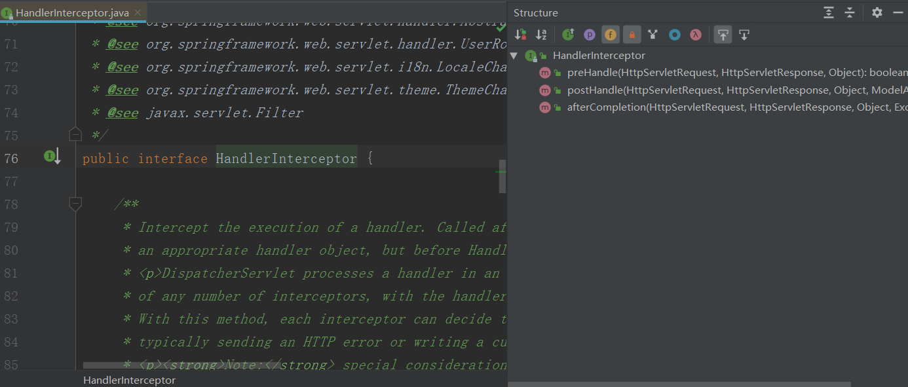
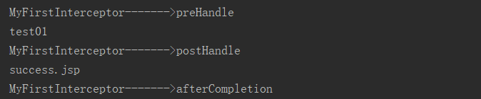
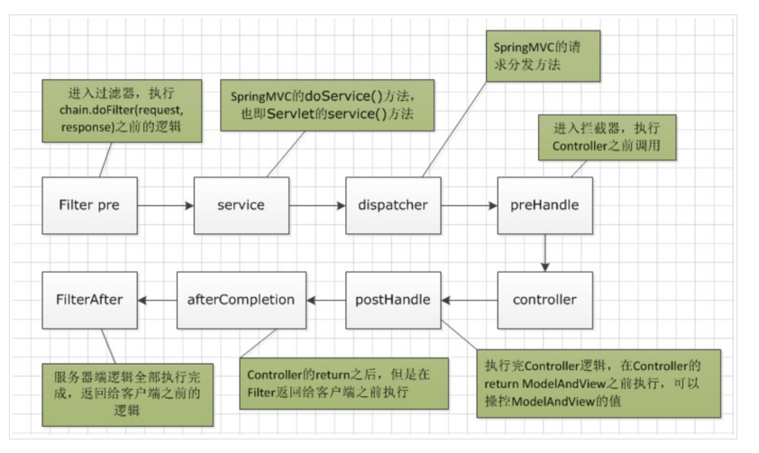
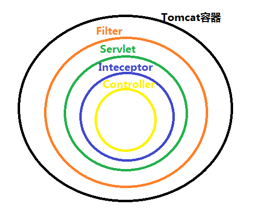
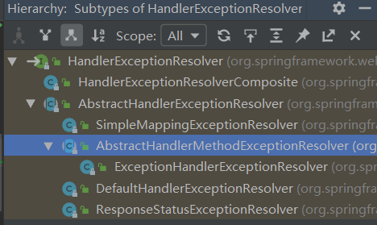
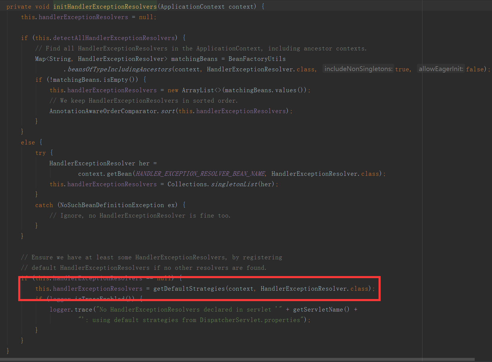

# SpringMVC的使用

### 1、文件下载

```java
package com.zab.controller;

import com.zab.bean.User;
import org.springframework.http.HttpEntity;
import org.springframework.http.HttpHeaders;
import org.springframework.http.HttpStatus;
import org.springframework.http.ResponseEntity;
import org.springframework.stereotype.Controller;
import org.springframework.util.MultiValueMap;
import org.springframework.web.bind.annotation.RequestBody;
import org.springframework.web.bind.annotation.RequestMapping;
import org.springframework.web.bind.annotation.ResponseBody;

import javax.servlet.ServletContext;
import javax.servlet.http.HttpServletRequest;
import java.io.FileInputStream;
import java.io.FileNotFoundException;

@Controller
public class OtherController {

    @RequestMapping("/download")
    public ResponseEntity<byte[]> download(HttpServletRequest request) throws Exception {
        //获取要下载文件的路径及输入流对象
        ServletContext servletContext = request.getServletContext();
        String realPath = servletContext.getRealPath("/script/jquery-1.9.1.min.js");
        FileInputStream fileInputStream = new FileInputStream(realPath);

        byte[] bytes = new byte[fileInputStream.available()];
        fileInputStream.read(bytes);
        fileInputStream.close();
        //将要下载文件内容返回
        HttpHeaders httpHeaders = new HttpHeaders();
        httpHeaders.set("Content-Disposition","attachment;filename=jquery-1.9.1.min.js");
        return  new ResponseEntity<byte[]>(bytes,httpHeaders,HttpStatus.OK);
    }
}

```

### 2、文件上传

​		Spring MVC 为文件上传提供了直接的支持，这种支持是通过即插即用的 **MultipartResolver** 实现的。Spring 用 **Jakarta Commons FileUpload** 技术实现了一个 MultipartResolver 实现类：**CommonsMultipartResovler**  

​		Spring MVC 上下文中默认没有装配 MultipartResolver，因此默认情况下不能处理文件的上传工作，如果想使用 Spring 的文件上传功能，需现在上下文中配置 MultipartResolver。

pom.xml

```xml
<?xml version="1.0" encoding="UTF-8"?>
<project xmlns="http://maven.apache.org/POM/4.0.0"
         xmlns:xsi="http://www.w3.org/2001/XMLSchema-instance"
         xsi:schemaLocation="http://maven.apache.org/POM/4.0.0 http://maven.apache.org/xsd/maven-4.0.0.xsd">
    <modelVersion>4.0.0</modelVersion>

    <groupId>com.zab</groupId>
    <artifactId>springmvc_upload</artifactId>
    <version>1.0-SNAPSHOT</version>

    <dependencies>
        <dependency>
            <groupId>org.springframework</groupId>
            <artifactId>spring-context</artifactId>
            <version>5.2.3.RELEASE</version>
        </dependency>
        <dependency>
            <groupId>org.springframework</groupId>
            <artifactId>spring-web</artifactId>
            <version>5.2.3.RELEASE</version>
        </dependency>
        <dependency>
            <groupId>org.springframework</groupId>
            <artifactId>spring-webmvc</artifactId>
            <version>5.2.3.RELEASE</version>
        </dependency>
        <dependency>
            <groupId>javax.servlet</groupId>
            <artifactId>javax.servlet-api</artifactId>
            <version>4.0.1</version>
            <scope>provided</scope>
        </dependency>

        <dependency>
            <groupId>javax.servlet</groupId>
            <artifactId>jsp-api</artifactId>
            <version>2.0</version>
            <scope>provided</scope>
        </dependency>
        <dependency>
            <groupId>com.fasterxml.jackson.core</groupId>
            <artifactId>jackson-core</artifactId>
            <version>2.10.3</version>
        </dependency>
        <dependency>
            <groupId>com.fasterxml.jackson.core</groupId>
            <artifactId>jackson-databind</artifactId>
            <version>2.10.3</version>
        </dependency>
        <dependency>
            <groupId>com.fasterxml.jackson.core</groupId>
            <artifactId>jackson-annotations</artifactId>
            <version>2.10.3</version>
        </dependency>
        <dependency>
            <groupId>commons-io</groupId>
            <artifactId>commons-io</artifactId>
            <version>2.6</version>
        </dependency>
        <dependency>
            <groupId>commons-fileupload</groupId>
            <artifactId>commons-fileupload</artifactId>
            <version>1.4</version>
        </dependency>
    </dependencies>
</project>
```

web.xml

```xml
<?xml version="1.0" encoding="UTF-8"?>
<web-app xmlns="http://xmlns.jcp.org/xml/ns/javaee"
         xmlns:xsi="http://www.w3.org/2001/XMLSchema-instance"
         xsi:schemaLocation="http://xmlns.jcp.org/xml/ns/javaee http://xmlns.jcp.org/xml/ns/javaee/web-app_4_0.xsd"
         version="4.0">

    <servlet>
        <servlet-name>springmvc</servlet-name>
        <servlet-class>org.springframework.web.servlet.DispatcherServlet</servlet-class>
        <init-param>
            <param-name>contextConfigLocation</param-name>
            <param-value>classpath:springmvc.xml</param-value>
        </init-param>
    </servlet>
    <servlet-mapping>
        <servlet-name>springmvc</servlet-name>
        <url-pattern>/</url-pattern>
    </servlet-mapping>
    <filter>
        <filter-name>encoding</filter-name>
        <filter-class>org.springframework.web.filter.CharacterEncodingFilter</filter-class>
        <init-param>
            <param-name>encoding</param-name>
            <param-value>UTF-8</param-value>
        </init-param>
        <init-param>
            <param-name>forceEncoding</param-name>
            <param-value>true</param-value>
        </init-param>
    </filter>
    <filter-mapping>
        <filter-name>encoding</filter-name>
        <url-pattern>/*</url-pattern>
    </filter-mapping>
</web-app>
```

springmvc.xml

```xml
<?xml version="1.0" encoding="UTF-8"?>
<beans xmlns="http://www.springframework.org/schema/beans"
       xmlns:xsi="http://www.w3.org/2001/XMLSchema-instance"
       xmlns:context="http://www.springframework.org/schema/context"
       xmlns:mvc="http://www.springframework.org/schema/mvc"

       xsi:schemaLocation="http://www.springframework.org/schema/beans http://www.springframework.org/schema/beans/spring-beans.xsd http://www.springframework.org/schema/context https://www.springframework.org/schema/context/spring-context.xsd http://www.springframework.org/schema/mvc https://www.springframework.org/schema/mvc/spring-mvc.xsd">
    <mvc:default-servlet-handler></mvc:default-servlet-handler>
    <mvc:annotation-driven></mvc:annotation-driven>
    <context:component-scan base-package="com.zab"></context:component-scan>

    <bean class="org.springframework.web.servlet.view.InternalResourceViewResolver">
        <property name="prefix" value="/WEB-INF/page/"></property>
        <property name="suffix" value=".jsp"></property>
    </bean>

    <bean id="multipartResolver" class="org.springframework.web.multipart.commons.CommonsMultipartResolver">
        <property name="defaultEncoding" value="UTF-8"></property>
        <property name="maxUploadSize" value="1024000"></property>
    </bean>
</beans>
```

UploadHandler.java

```java
package com.zab.controller;

import org.springframework.stereotype.Controller;
import org.springframework.web.bind.annotation.RequestMapping;
import org.springframework.web.bind.annotation.RequestMethod;
import org.springframework.web.bind.annotation.RequestParam;
import org.springframework.web.multipart.MultipartFile;

import java.io.File;
import java.io.IOException;
import java.io.InputStream;

@Controller
public class UploadHandler {

    @RequestMapping(value = "/testUpload", method = RequestMethod.POST)
    public String testUpload(@RequestParam(value = "desc", required = false) String desc, @RequestParam("file") MultipartFile multipartFile) throws IOException {
        System.out.println("desc : " + desc);
        System.out.println("OriginalFilename : " + multipartFile.getOriginalFilename());
        multipartFile.transferTo(new File("D:\\file\\"+multipartFile.getOriginalFilename()));

        return "success";
    }
}
```

如果是多文件上传，那么又改如何处理呢？

UploadHandler.java

```java
package com.zab.controller;

import org.springframework.stereotype.Controller;
import org.springframework.web.bind.annotation.RequestMapping;
import org.springframework.web.bind.annotation.RequestMethod;
import org.springframework.web.bind.annotation.RequestParam;
import org.springframework.web.multipart.MultipartFile;

import java.io.File;
import java.io.IOException;
import java.io.InputStream;

@Controller
public class UploadHandler {

    @RequestMapping(value = "/testUpload", method = RequestMethod.POST)
    public String testUpload(@RequestParam(value = "desc", required = false) String desc, @RequestParam("file") MultipartFile[] multipartFile) throws IOException {
        System.out.println("desc : " + desc);
        for (MultipartFile file : multipartFile) {
            if (!file.isEmpty()) {
                System.out.println("OriginalFilename : " + file.getOriginalFilename());
                file.transferTo(new File("D:\\file\\" + file.getOriginalFilename()));
            }
        }

        return "success"; 
    }
}
```

### 3、Springmvc拦截器

​		SpringMVC提供了拦截器机制，允许运行目标方法之前进行一些拦截工作或者目标方法运行之后进行一下其他相关的处理。自定义的拦截器必须实现**HandlerInterceptor**接口。

 

​		**preHandle**()：这个方法在业务处理器处理请求之前被调用，在该方法中对用户请求 request 进行处理。如果程序员决定该拦截器对请求进行拦截处理后还要调用其他的拦截器，或者是业务处理器去进行处理，则返回true；如果程序员决定不需要再调用其他的组件去处理请求，则返回false

​		**postHandle**()：这个方法在业务处理器处理完请求后，但是DispatcherServlet 向客户端返回响应前被调用，在该方法中对用户请求request进行处理。

​		**afterCompletion**()：这个方法在DispatcherServlet完全处理完请求后被调用，可以在该方法中进行一些资源清理的操作。

##### 1、自定义第一个拦截器

MyFirstInterceptor.java

```java
package com.zab.interceptor;


import org.springframework.web.servlet.HandlerInterceptor;
import org.springframework.web.servlet.ModelAndView;

import javax.servlet.http.HttpServletRequest;
import javax.servlet.http.HttpServletResponse;

public class MyFirstInterceptor implements HandlerInterceptor {
    public boolean preHandle(HttpServletRequest request, HttpServletResponse response, Object handler) throws Exception {
        System.out.println(this.getClass().getName()+"------->preHandle");
        return true;
    }

    public void postHandle(HttpServletRequest request, HttpServletResponse response, Object handler, ModelAndView modelAndView) throws Exception {
        System.out.println(this.getClass().getName()+"------->postHandle");
    }

    public void afterCompletion(HttpServletRequest request, HttpServletResponse response, Object handler, Exception ex) throws Exception {
        System.out.println(this.getClass().getName()+"------->afterCompletion");
    }
}

```

TestInterceptorController.java

```java
package com.zab.controller;

import org.springframework.stereotype.Controller;
import org.springframework.web.bind.annotation.RequestMapping;

@Controller
public class TestInterceptorController {

    @RequestMapping("test01")
    public String test01(){
        System.out.println("test01");
        return "success";
    }
}
```

springmvc.xml

```xml
<?xml version="1.0" encoding="UTF-8"?>
<beans xmlns="http://www.springframework.org/schema/beans"
       xmlns:xsi="http://www.w3.org/2001/XMLSchema-instance"
       xmlns:context="http://www.springframework.org/schema/context"
       xmlns:mvc="http://www.springframework.org/schema/mvc"

       xsi:schemaLocation="http://www.springframework.org/schema/beans http://www.springframework.org/schema/beans/spring-beans.xsd http://www.springframework.org/schema/context https://www.springframework.org/schema/context/spring-context.xsd http://www.springframework.org/schema/mvc https://www.springframework.org/schema/mvc/spring-mvc.xsd">
    <mvc:default-servlet-handler></mvc:default-servlet-handler>
    <mvc:annotation-driven></mvc:annotation-driven>
    <context:component-scan base-package="com.zab"></context:component-scan>

    <bean class="org.springframework.web.servlet.view.InternalResourceViewResolver">
        <property name="prefix" value="/WEB-INF/page/"></property>
        <property name="suffix" value=".jsp"></property>
    </bean>
    <mvc:interceptors>
        <bean class="com.zab.interceptor.MyFirstInterceptor"></bean>
    </mvc:interceptors>
</beans>
```

success.jsp

```jsp
<%@ page contentType="text/html;charset=UTF-8" language="java" %>
<html>
<head>
    <title>Title</title>
</head>
<body>
<% System.out.println("success.jsp");%>
success
</body>
</html>

```

​		通过运行结果能够发现拦截器的执行顺序如下：



​		可以看到先执行拦截器的preHandle方法----》执行目标方法----》执行拦截器的postHandle方法----》执行页面跳转----》执行拦截器的afterCompletion方法

​		在配置拦截器的时候有两个需要注意的点：

​		1、如果prehandle方法返回值 为false，那么意味着不放行，那么就会造成后续的所有操作都中断

​		2、如果执行到方法中出现异常，那么后续流程不会处理但是afterCompletion方法会执行

##### 2、定义多个拦截器

​		再添加另外一个拦截器

MySecondInterceptor.java

```java
package com.zab.interceptor;


import org.springframework.web.servlet.HandlerInterceptor;
import org.springframework.web.servlet.ModelAndView;

import javax.servlet.http.HttpServletRequest;
import javax.servlet.http.HttpServletResponse;

public class MySecondInterceptor implements HandlerInterceptor {
    public boolean preHandle(HttpServletRequest request, HttpServletResponse response, Object handler) throws Exception {
        System.out.println(this.getClass().getName()+"------->preHandle");
        return true;
    }

    public void postHandle(HttpServletRequest request, HttpServletResponse response, Object handler, ModelAndView modelAndView) throws Exception {
        System.out.println(this.getClass().getName()+"------->postHandle");
    }

    public void afterCompletion(HttpServletRequest request, HttpServletResponse response, Object handler, Exception ex) throws Exception {
        System.out.println(this.getClass().getName()+"------->afterCompletion");
    }
}

```

看到如下执行顺序：


调整两个拦截器的配置顺序：


大家可以看到对应的效果，谁先执行取决于配置的顺序。

​		拦截器的preHandle是按照顺序执行的

​		拦截器的postHandle是按照逆序执行的

​		拦截器的afterCompletion是按照逆序执行的

​		如果执行的时候核心的业务代码出问题了，那么已经通过的拦截器的afterCompletion会接着执行。

### 4、拦截器跟过滤器的区别

​		1、过滤器是基于函数回调的，而拦截器是基于java反射的

​		2、过滤器依赖于servlet容器，而拦截器不依赖与Servlet容器

​		3、连接器几乎对所有的请求都起作用和，而拦截器只能对action请求起作用

​		4、拦截器可以访问action的上下文，而过滤器不可以

​		5、在action的生命周期中，拦截器可以多次调用，而过滤器只能在容器初始化的时候调用一次





### 5、SpringMVC异常处理机制

​		在SpringMVC中拥有一套非常强大的异常处理机制，SpringMVC通过HandlerExceptionResolver处理程序的异常，包括请求映射，数据绑定以及目标方法的执行时发生的异常。



在容器启动好，进入DispatcherServlet之后，会对HandlerExceptionResolver进行初始化操作：



会默认的从DispatcherServlet.properties中找到对应的异常处理类：

```properties
#默认的处理类
org.springframework.web.servlet.HandlerExceptionResolver=
#处理@ExceptionHandler
org.springframework.web.servlet.mvc.method.annotation.ExceptionHandlerExceptionResolver,\
#处理@ResponseStatus，给自定义异常使用
org.springframework.web.servlet.mvc.annotation.ResponseStatusExceptionResolver,\
#判断是否是SpringMVC自带异常
org.springframework.web.servlet.mvc.support.DefaultHandlerExceptionResolver
```

ExceptionController.java

```java
package com.zab.controller;

import org.springframework.stereotype.Controller;
import org.springframework.web.bind.annotation.ExceptionHandler;
import org.springframework.web.bind.annotation.RequestMapping;
import org.springframework.web.servlet.ModelAndView;

import javax.jws.WebParam;

@Controller
public class ExceptionController {

    @RequestMapping("exception1")
    public String exception(){
        System.out.println("exception.......");
        System.out.println(10/0);
        return "success";
    }

    @ExceptionHandler(value = {ArithmeticException.class})
    public ModelAndView handlerException(Exception exception){
        ModelAndView mv = new ModelAndView();
        mv.setViewName("error");
        mv.addObject("ex",exception);
        return mv;
    }
}
```

​		在一个类中可能会包含多个异常的处理方法，在不同的方法上可以使用不同范围的异常，在查找的时候会优先调用范围小的异常处理；

```java
package com.zab.controller;

import org.springframework.stereotype.Controller;
import org.springframework.web.bind.annotation.ExceptionHandler;
import org.springframework.web.bind.annotation.RequestMapping;
import org.springframework.web.servlet.ModelAndView;

import javax.jws.WebParam;

@Controller
public class ExceptionController {

    @RequestMapping("exception1")
    public String exception(){
        System.out.println("exception.......");
        System.out.println(10/0);
        return "success";
    }

    @ExceptionHandler(value = {ArithmeticException.class})
    public ModelAndView handlerException1(Exception exception){
        System.out.println("handlerException1........");
        ModelAndView mv = new ModelAndView();
        mv.setViewName("error");
        mv.addObject("ex",exception);
        return mv;
    }

    @ExceptionHandler(value = {Exception.class})
    public ModelAndView handlerException2(Exception exception){
        System.out.println("handlerException2........");
        ModelAndView mv = new ModelAndView();
        mv.setViewName("error");
        mv.addObject("ex",exception);
        return mv;
    }
}
```

​		在不同的类中可能会包含不同的异常处理，因此我们需要定义一个全局的异常控制器,使用@ControllerAdvice注解标注，如果本类跟全局都有相关异常的处理，那么会优先使用本类的。

```java
package com.zab.controller;

import org.springframework.web.bind.annotation.ControllerAdvice;
import org.springframework.web.bind.annotation.ExceptionHandler;
import org.springframework.web.servlet.ModelAndView;

@ControllerAdvice
public class MyGlobalExceptionHandler {
    @ExceptionHandler(value = {ArithmeticException.class})
    public ModelAndView handlerException1(Exception exception){
        System.out.println("handlerException1........");
        ModelAndView mv = new ModelAndView();
        mv.setViewName("error");
        mv.addObject("ex",exception);
        return mv;
    }
}
```
